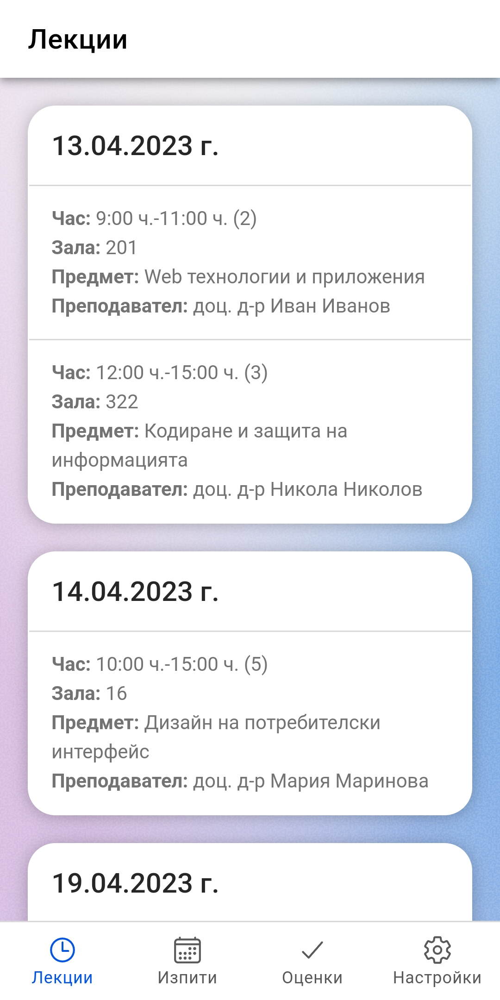
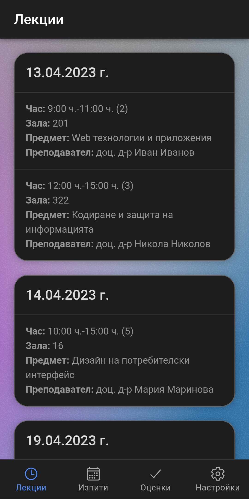
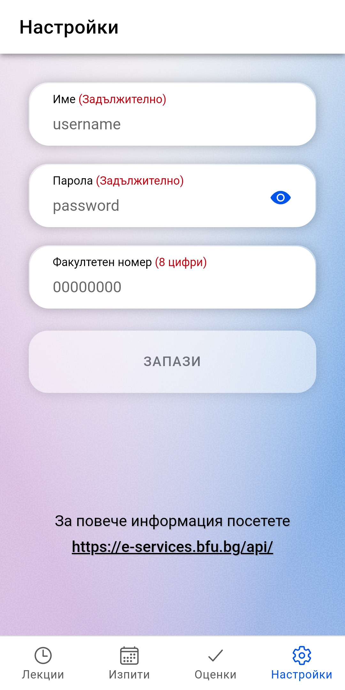
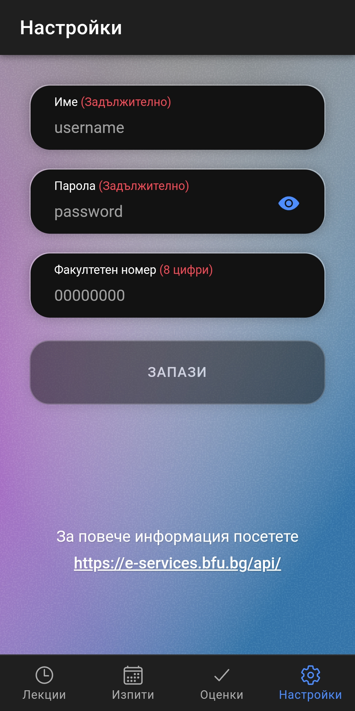

### Installation

```
$ git clone https://github.com/dimitrov4/eservices-bfu
$ cd eservices-bfu
$ npm install
$ npm run build
$ ionic cap run android --prod
```

### Screenshots

<p float="left">
  
  
</p>
<p float="left">
  
  
</p>
